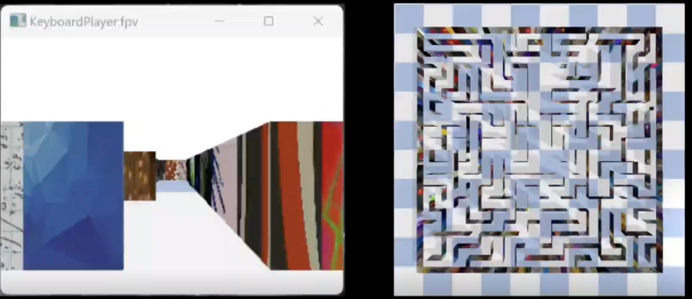

# Embodied AI Platform
# Simulation Development



**Platform**: https://github.com/ai4ce/vis_nav_player/

**References**: https://www.linkedin.com/posts/simbaforrest_its-been-a-fun-semester-in-fall-2023-when-activity-7143437082135334913-6KT0

## Requirement
1. Windows/Mac/Linux


# Real World Development
## Requirement
1. Ubunut 20.04
2. ROS Noetic (http://wiki.ros.org/noetic/Installation/Ubuntu)
3. Install Dependent ROS Packages
    ```console
    sudo apt-get install ros-<ros version>-robot-descriptionsudo apt-get install ros-noetic-joy ros-noetic-teleop-twist-joy \
    ros-noetic-teleop-twist-keyboard ros-noetic-laser-proc \
    ros-noetic-rgbd-launch ros-noetic-rosserial-arduino \
    ros-noetic-rosserial-python ros-noetic-rosserial-client \
    ros-noetic-rosserial-msgs ros-noetic-amcl ros-noetic-map-server \
    ros-noetic-move-base ros-noetic-urdf ros-noetic-xacro \
    ros-noetic-compressed-image-transport ros-noetic-rqt* ros-noetic-rviz \
    ros-noetic-gmapping ros-noetic-navigation ros-noetic-interactive-markers
    ```
4. Install TurtleBot3 Packages
    ```console
    sudo apt install ros-noetic-dynamixel-sdk
    sudo apt install ros-noetic-turtlebot3-msgs
    sudo apt install ros-noetic-turtlebot3
    ```


## Setup
### 1. Workspace Preparation
create a separate catkin_workspace to avoid any conflicts with your current ones

```console
mkdir -p catkin_ws/src
cd catkin_ws/
catkin_make
source devel/setup.bash
```

### 2. Download Repo
1. go to src folder
```console
cd src
```
2. download this repo
```console
git clone https://github.com/ai4ce/Embodied_AI_Platform.git
```
3. switch to the current branch
```console
git clone -b RW_dev https://github.com/ai4ce/Embodied_AI_Platform.git

or git checkout RW_dev
```

4. download the official turtlebot3 repo
```
cd Embodied_AI_Platform
git clone https://github.com/ROBOTIS-GIT/turtlebot3.git
```


5. catkin_make the package
go to the root director of the catkin_ws/
```console
cd catkin_ws/
catkin_make
```
6. check whether you successfully build the package
```console
rospack list | grep turtlebot3
```
if you see the output and it shows the path to that package, which means you build the package successfully 


### 3. Run Demo
### Launch Camera
**On Turtlebot (Raspberry Pi)**:

ssh ubuntu@${Turtlebot_ip_address}

```console
roslaunch turtlebot3_bringup turtlebot3_rpicamera.launch
```
**On Remote PC**:

```console
# Terminal1: 
roscore

# Terminal2: 
cd real_world
python3 camera.py
```

### Launch Keyboard
**On Turtlebot (Raspberry Pi)**:

ssh ubuntu@${Turtlebot_ip_address}

```console
roslaunch turtlebot3_bringup turtlebot3_robot.launch
```

**On Remote PC**:

```console
export TURTLEBOT3_MODEL=burger
roslaunch turtlebot3_teleop turtlebot3_teleop_key.launch
```

If the node is successfully launched, the following instruction will be appeared to the terminal window. 
```console
Control Your Turtlebot3
Moving around
     w
 a   s   d
     x
w/x : increase/decrease linear velocity
a/d : increase/decrease angular velocity
space key, s : force stop
CTRL-C to quit

```